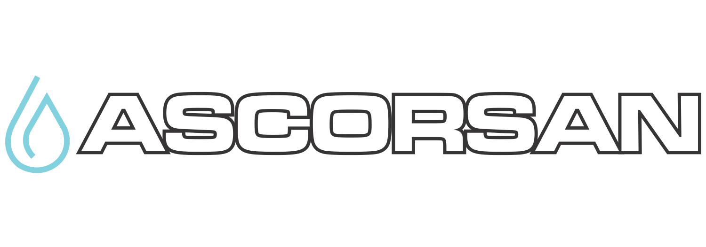
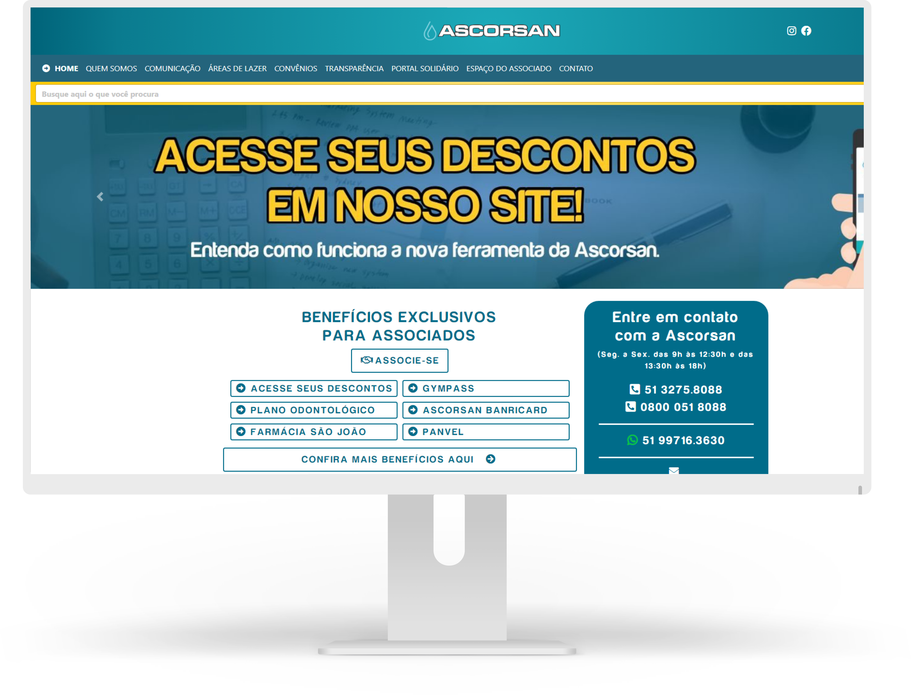

<p align="center"> 
    <a href="https://ascorsan.com.br/">
        
    </a>
</p>

----



# Indice

- [Sobre](#-sobre)
- [Tecnologias](#Tecnologias)
- [Download](#Download)
- [Como baixar o projeto](#-como-baixar-o-projeto)

## 🔖&nbsp; Sobre

Projeto desenvolvido para a Associação de servidores da corsan [ASCORSAN](https://ascorsan.com.br/)

---
## Tecnologias

Esse projeto foi desenvolvido com as seguintes tecnologias:

- [PHP](https://www.php.net/manual/pt_BR/intro-whatis.php)
- [Wordpress](https://br.wordpress.com/)

---

## 🗂 Como baixar o projeto

```bash

    # Clonar o repositório
    $ git clone https://github.com/filipeleonelbatista/ascorsan-theme.git

    # Entrar no diretório desejado
    $ cd ascorsan-theme
```

* Necessário Wordpress instalado localmente. Colocar dentro da pasta de temas do wordpress.

---

<h3 align="center" >Vamos nos conectar 😉</h3>
<p align="center">
  <a href="https://www.linkedin.com/in/filipeleonelbatista/">
    
  </a>&ensp;
  <a href="mailto:filipe.x2016@gmail.com">
    
  </a>&ensp;
  <a href="https://instagram.com/filipeleonelbatista">
    
  </a>
</p>
<br />
<p align="center">
    Desenvolvido 💜 por Filipe Batista 
</p>
